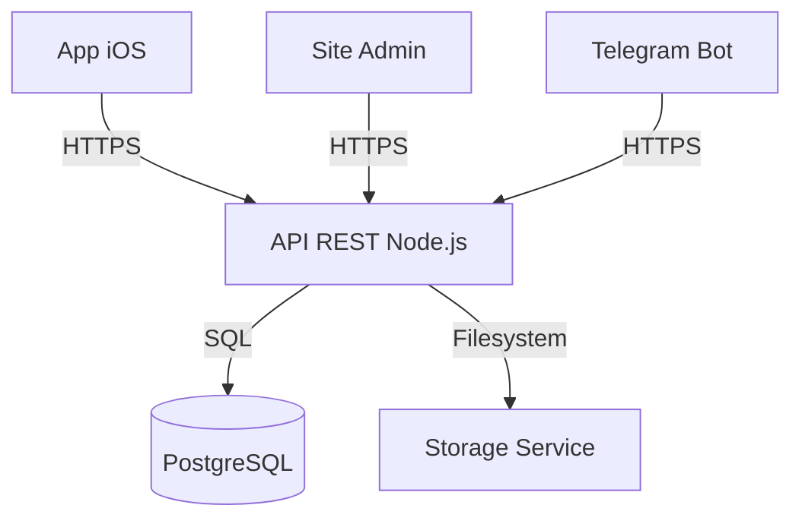

# Arquitetura do Sistema ZROK (Backend e API)

## 1. Arquitetura Proposta
O sistema utilizará uma API centralizada em Node.js com TypeScript, servindo como a única fonte de verdade para o aplicativo iOS, o futuro painel web administrativo e o bot do Telegram.



## 2. Tecnologias
- **Backend:** Node.js, TypeScript, Express.js.
- **Banco de Dados:** PostgreSQL (ORM: Prisma).
- **Bot:** Telegraf.js.
- **Segurança:** JWT, bcrypt para hashing de senhas.
- **Configuração:** `.env` (dotenv).

## 3. Entidades Principais
- **User/Admin:** Gerenciamento de acessos administrativos.
- **LicenseKey:** Chaves de ativação, status, dispositivos vinculados.
- **Device:** Dispositivos autorizados vinculados a uma LicenseKey.
- **Feature:** Definições das funcionalidades (nome, categoria, status, metadata).
- **Resource/File:** Versões dos binários associados às funcionalidades, metadados de patch.

## 4. Estrutura de Pastas (Nova `backend/` no root)
```text
backend/
├── src/
│   ├── auth/         # Autenticação e Autorização
│   ├── controllers/  # Lógica dos Endpoints
│   ├── services/     # Lógica de Negócio (License, Feature, Storage)
│   ├── routes/       # Definição de Rotas API
│   ├── bot/          # Telegram Bot
│   ├── db/           # Prisma client/migrations
│   └── app.ts        # Entry point
├── prisma/           # Schema do banco
└── .env              # Configurações (NÃO COMMITAR)
```

## 5. Fluxos Principais
- **Validação de Key:** App envia Key+DeviceID -> API valida no banco -> Retorna token JWT de sessão.
- **Sincronização:** App solicita `/api/v1/bootstrap` -> API retorna lista de Features ativas, configurações e URLs de download assinadas.
- **Ações Telegram:** Admin autorizado envia comando -> Bot valida autorização -> Bot chama API interna -> API executa e retorna resultado -> Bot responde.

## 6. Segurança
- HTTPS obrigatório.
- Rate limiting por IP e por endpoint.
- Não exposição de senhas/hashes/tokens.
- Validação de entrada rigorosa (Zod).
- Logs auditáveis (sem dados sensíveis).
